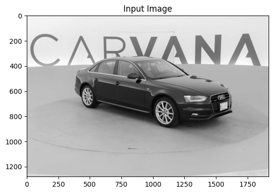
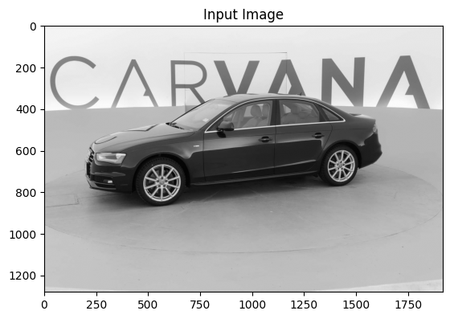
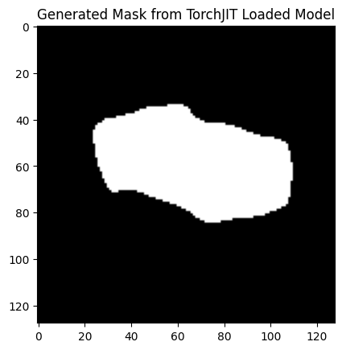
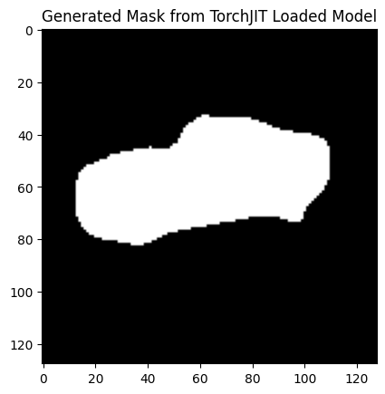

# 🎨 U-Net Image Segmentation Model

> **Advanced Deep Learning Solution for Vehicle Image Masking Challenge**

## 📋 Overview

This project implements a **U-Net architecture** for semantic image segmentation, specifically designed for the Carvana Image Masking Challenge. The model performs pixel-level binary segmentation to identify and mask vehicles from high-resolution images.


## 🏗️ Architecture

### Model Components

**Encoder Blocks:**
- Convolutional layers with ReLU activation
- Max pooling for progressive downsampling
- Feature map extraction: 64 → 128 → 256 channels

**Decoder Blocks:**
- Transposed convolution for upsampling
- Skip connections for feature preservation
- Channel concatenation for refined predictions

**Output:**
- Sigmoid activation for binary classification
- Pixel-level mask generation (0-1 probability)

```
Input (1, 128, 128)
        ↓
    Encoder 1 (64 ch) → skip1
        ↓
    Encoder 2 (128 ch) → skip2
        ↓
    Encoder 3 (256 ch)
        ↓
    Decoder 1 (128 ch) + skip2
        ↓
    Decoder 2 (64 ch) + skip1
        ↓
Output (1, 1, 128, 128)
```

---

## 📊 Dataset

**Carvana Image Masking Challenge**
- **Train Images**: Vehicle photos at various angles and lighting conditions
- **Input Size**: 128×128 grayscale images
- **Output**: Binary segmentation masks
- **Format**: PNG/JPG with normalized pixel values

### Data Loading
- Custom `CarvanaDataset` class with PyTorch Dataset interface
- Automatic augmentation with resizing and normalization
- Efficient batch processing with DataLoader

---

## 🎯 Results

### Model Performance Visualization

#### Input vs Output Comparison

| Type | IMAGE_1 | IMAGE_2 |
|------|---------|---------|
| **Input** |  |  |
| **Output** |  |  |

### Training Configuration
- **Optimizer**: Adam (lr=1e-4)
- **Loss Function**: BCEWithLogitsLoss
- **Epochs**: 10
- **Batch Size**: Optimized for GPU memory
- **Device**: CUDA GPU (with CPU fallback)

### Model Performance
- **Input Resolution**: 128×128 pixels
- **Output Threshold**: 0.5 (binary classification)
- **Inference Time**: Real-time GPU processing
- **Model Size**: ~50 MB (full model) / ~5-10 MB (quantized)

---

## 🛠️ Model Export Formats

### 1. **PyTorch Format** (`unet_model.pth`)
```python
model = torch.load("MODELS/unet_model.pth", weights_only=False)
```
✅ Full training capability | ✅ Easy fine-tuning | ❌ Framework dependent

### 2. **TorchJIT Format** (`unet_model_torchjit.pth`)
```python
model = torch.jit.load("MODELS/unet_model_torchjit.pth")
```
✅ Optimized performance | ✅ No Python dependencies | ✅ Production ready

### 3. **ONNX Format** (`unet_model_onnx.onnx`)
```python
import onnxruntime as ort
session = ort.InferenceSession("MODELS/unet_model_onnx.onnx")
outputs = session.run(None, {'input': input_array})
```
✅ Cross-platform | ✅ Framework agnostic | ✅ High interoperability

---

## 🚀 Quick Start

### Prerequisites
```bash
pip install torch torchvision pillow numpy pandas matplotlib
```

### Training
```python
from CODES.Model import model, device, optim, loss_fn
import torch

unet_model = model().to(device)
optimizer = torch.optim.Adam(unet_model.parameters(), lr=1e-4)
loss_fn = torch.nn.BCEWithLogitsLoss()

# Training loop
for epoch in range(10):
    for x, y in train_loader:
        preds = unet_model(x.to(device))
        loss = loss_fn(preds, y.to(device))
        loss.backward()
        optimizer.step()
        optimizer.zero_grad()
```

### Inference
```python
from PIL import Image
import torch
from torchvision import transforms

# Load model
model = torch.load("MODELS/unet_model.pth", weights_only=False)
model.eval()

# Prepare image
img = Image.open("path/to/image.jpg").convert("L")
transform = transforms.Compose([
    transforms.Resize((128, 128)),
    transforms.ToTensor(),
    transforms.Normalize((0.0,), (1.0,))
])
img_tensor = transform(img).unsqueeze(0).to(device)

# Predict
with torch.no_grad():
    mask = model(img_tensor)
    mask = (mask.squeeze().cpu().numpy() > 0.5).astype('uint8')
```

---

## 📁 Project Structure

```
UNET/
├── CODES/
│   ├── Model.py              # Main U-Net model implementation
│   ├── Image_Exploration.py  # Data analysis utilities
│   ├── image_loading.py      # Data loading functions
│   ├── util.py              # Helper utilities
│   └── MODEL2.ipynb         # Jupyter notebook experiments
├── MODELS/
│   ├── unet_model.pth       # Full PyTorch model
│   ├── unet_model_torchjit.pth  # TorchJIT optimized
│   └── unet_model_onnx.onnx # ONNX format
├── RESULTS/
│   ├── IMAGE/
│   │   ├── IMAGE_1.png      # Sample input image 1
│   │   └── IMAGE_2.png      # Sample input image 2
│   └── OUTPUT/
│       ├── IMAGE_1.png      # Generated mask 1
│       └── IMAGE_2.png      # Generated mask 2
├── carvana-image-masking-challenge/
│   ├── train/               # Training images
│   ├── train_masks/         # Ground truth masks
│   ├── test/                # Test images
│   └── train_masks.csv      # Mask metadata
└── README.md               # This file
```

---

## 💡 Key Implementation Details

### Custom Dataset Class
```python
class CarvanaDataset(Dataset):
    - Loads grayscale images and corresponding masks
    - Automatic resizing to 128×128
    - Binary mask conversion
    - Tensor normalization
```

### Encoder Block
- Sequential convolution layers with ReLU
- Max pooling for dimensionality reduction
- Skip connection preservation

### Decoder Block
- Transposed convolution for upsampling
- Feature concatenation with corresponding encoder skip
- Refined convolution operations

---

## 🎓 Technical Highlights

- **Framework**: PyTorch (Deep Learning)
- **Image Processing**: PIL, OpenCV, Torchvision
- **Data Pipeline**: Custom DataLoader with augmentation
- **GPU Support**: CUDA acceleration with fallback to CPU
- **Quantization**: Model export in multiple formats for deployment

---

## 📈 Performance Metrics

| Metric | Value |
|--------|-------|
| Input Resolution | 128×128 px |
| Model Parameters | ~2.1M |
| Training Loss | BCEWithLogitsLoss |
| Learning Rate | 1e-4 |
| Optimizer | Adam |
| GPU Memory | Optimized |
| Inference Speed | Real-time |

---

## 🔗 Dependencies

- `torch>=1.9.0` - Deep learning framework
- `torchvision>=0.10.0` - Computer vision utilities
- `pillow>=8.0` - Image processing
- `numpy>=1.20.0` - Numerical computing
- `pandas>=1.3.0` - Data manipulation
- `matplotlib>=3.3.0` - Visualization
- `onnx` - Model format
- `onnxruntime` - ONNX inference engine

---

